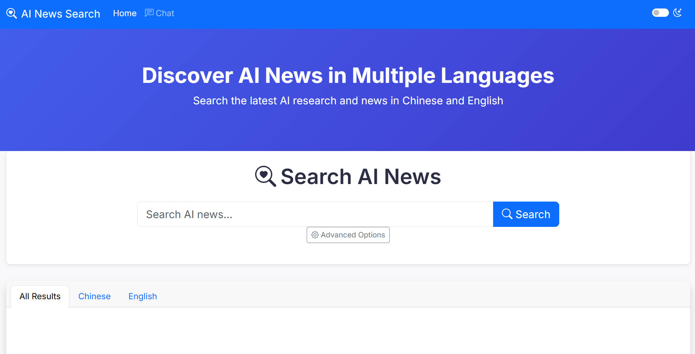
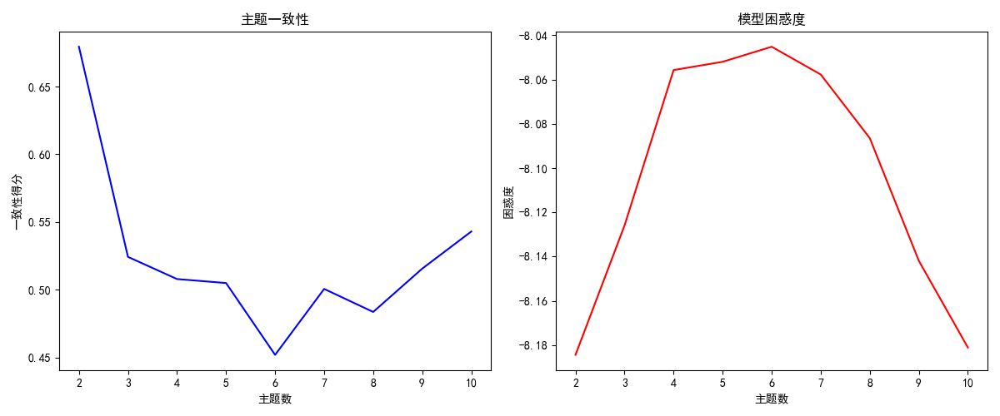

# Multilingual Information Retrieval System

A Flask-based web application for multilingual (Chinese/English) information retrieval with search capabilities, chat interface (RAG), and LDA topic modeling.

## Features

- **Multilingual Search**: Supports both Chinese and English content
- **Chat Interface**: RAG (Retrieval-Augmented Generation) powered chat
- **Topic Modeling**: LDA analysis for document clustering
- **Web Interface**: User-friendly web UI with search and chat functionality
- **Advanced NLP**: Utilizes LangChain and HuggingFace models

## Installation

1. Clone the repository
2. Install dependencies:
```bash
pip install -r requirements.txt
```

3. Download required models (place in `models/` directory)
4. Configure settings in `config/settings.py`

## Usage

### Running the Application
```bash
python app.py
```

The web interface will be available at `http://localhost:5000`

### API Endpoints

- `GET /search?q=<query>` - Search endpoint
- `POST /api/chat` - Chat API endpoint
  - Requires JSON payload with `message` and optional `session_id`

## Project Structure

```
├── app.py                - Main application entry point
├── chat/                 - RAG chat implementation
├── config/               - Configuration files
│   ├── spellcheck/       - Dictionary files
│   ├── stopwords/        - Stopword lists
│   ├── synonyms/         - Thesaurus files
│   └── settings.py       - Application settings
├── crawler/              - Web crawling components
├── data/                 - Data storage
├── indexer/              - Indexing components
├── LDA/                  - Topic modeling implementation
├── models/               - NLP models
├── search/               - Search engine core
├── static/               - Static assets (CSS, JS)
├── templates/            - HTML templates
└── utils/                - Utility functions
```

## Dependencies

Key dependencies include:
- Flask (web framework)
- BeautifulSoup (web scraping)
- Gensim (topic modeling)
- Jieba (Chinese text processing)
- LangChain (AI capabilities)
- Matplotlib/Seaborn (visualization)

## Screenshots




## License

[MIT License]
